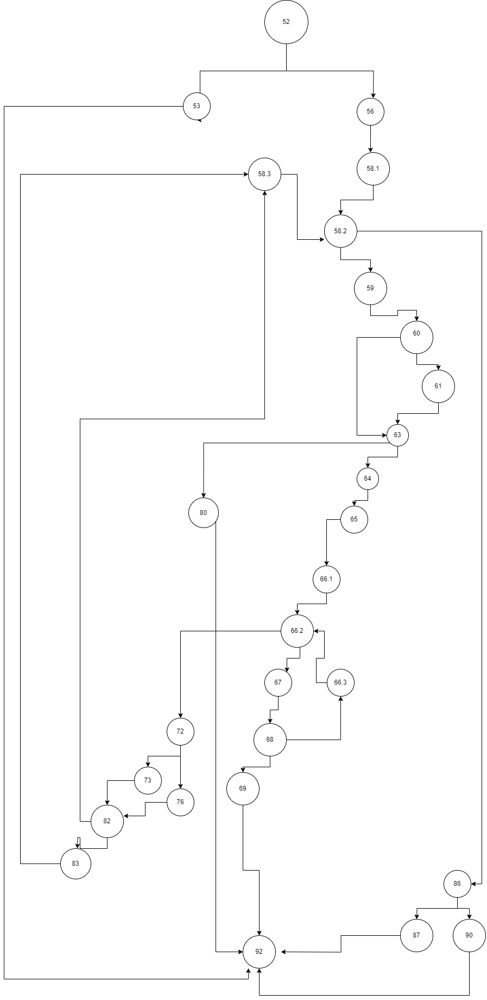

# SI_2024_lab2_225121
Ana Sazdova 225121
## Control Flow Graph

## Цикломатска Комплексност
Цикломатската комплексност на овој код е 10, истата ја добив преку формулата P+1, каде што P е бројот на предикатни јазли. Во случајoв P=1, па цикломатската комплексност изнесува 10.

## Тест случаи според критериумот Every branch

|         | null,9 | [Item("",null,8,9)],7 | [Item("","a",6,5)],4 | [Item("w","0",301,5)],1555 | [Item("e","2",6,0)],4 |
|---------|--------|-----------------------|----------------------|----------------------------|-----------------------|
| 52-53   | -      |                       |                      |                            |                       |
| 52-56   |        | -                     | -                    | -                          | -                     |
| 58.2-59 |        | -                     | -                    | -                          | -                     |
| 58.2-86 |        |                       |                      | -                          | -                     |
| 60-61   |        | -                     | -                    |                            |                       |
| 60-63   |        |                       |                      | -                          | -                     |
| 63-64   |        |                       | -                    | -                          | -                     |
| 63-80   |        | -                     |                      |                            |                       |
| 66.2-72 |        |                       |                      | -                          | -                     |
| 66.2-67 |        |                       | -                    | -                          | -                     |
| 68-66.3 |        |                       |                      | -                          | -                     |
| 68-69   |        |                       | -                    |                            |                       |
| 72-73   |        |                       |                      | -                          |                       |
| 72-76   |        |                       |                      |                            | -                     |
| 82-83   |        |                       |                      | -                          |                       |
| 82-58.3 |        |                       |                      |                            | -                     |
| 86-87   |        |                       |                      | -                          |                       |
| 86-90   |        |                       |                      |                            | -                     |

## Тест случаи според критериумот Multiple Condition

| item.getPrice() > 300 | item.getDiscount() > 0 | item.getBarcode().charAt(0)== '0' | test cases              |
|-----------------------|------------------------|-----------------------------------|-------------------------|
| F                     | X                      | X                                 | Item("v","1",298,0)     |
| T                     | F                      | X                                 | Item("t","1",302,0)     |
| T                     | T                      | F                                 | Item("u","1",303,0.85f) |
| T                     | T                      | T                                 | Item("m","0",304,0.08f) |

## Објаснување unit tests
При тестирање на Every Branch критериумот се користи assertException за фаќање на исклучоците како и assertEqual дали се соодветните, а за останатите се користи assertTrue or assertFalse 
За multiple Conditions се користи assertTrue и assertFalse 

